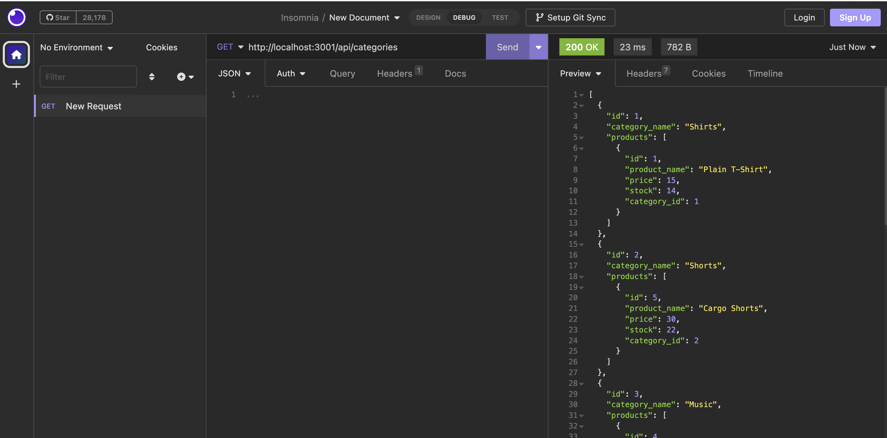
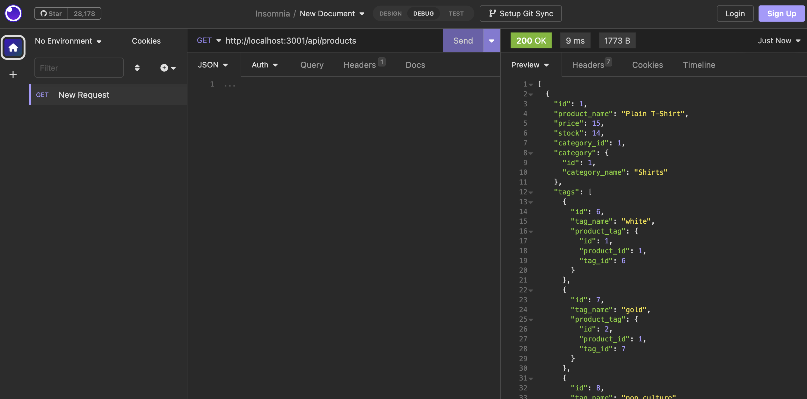
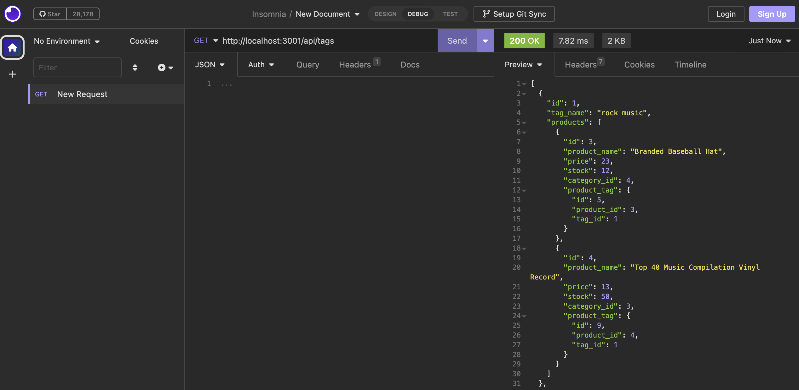

# e-commerce-backend

An Express.js application that mimics the backend of e-commerce application. The code uses Sequelize to interact with a MySQL database.

## User Story

```md
AS A manager at an internet retail company
I WANT a back end for my e-commerce website that uses the latest technologies
SO THAT my company can compete with other e-commerce companies
```

## Acceptance Criteria

```md
GIVEN a functional Express.js API
WHEN I add my database name, MySQL username, and MySQL password to an environment variable file
THEN I am able to connect to a database using Sequelize
WHEN I enter schema and seed commands
THEN a development database is created and is seeded with test data
WHEN I enter the command to invoke the application
THEN my server is started and the Sequelize models are synced to the MySQL database
WHEN I open API GET routes in Insomnia for categories, products, or tags
THEN the data for each of these routes is displayed in a formatted JSON
WHEN I test API POST, PUT, and DELETE routes in Insomnia
THEN I am able to successfully create, update, and delete data in my database
```

## Mock-Up

The following screenshots show application's GET routes to return all categories,all products and all the tags being tested in Insomnia:




## Usage

To use this application, go the following API endpoints:

```
http://localhost:3001/api/categories
```

```
http://localhost:3001/api/categories/:id
```

```
http://localhost:3001/api/products
```

```
http://localhost:3001/api/products/:id
```

```
http://localhost:3001/api/tags
```

```
http://localhost:3001/api/tags/:id
```

## Walkthrough Video

The following video shows the functionality of this application:

[Walkthrough Video Link](https://drive.google.com/file/d/18p3xdYmUXcP095scrKLEBlMj3upCUFjU/view?usp=sharing)
